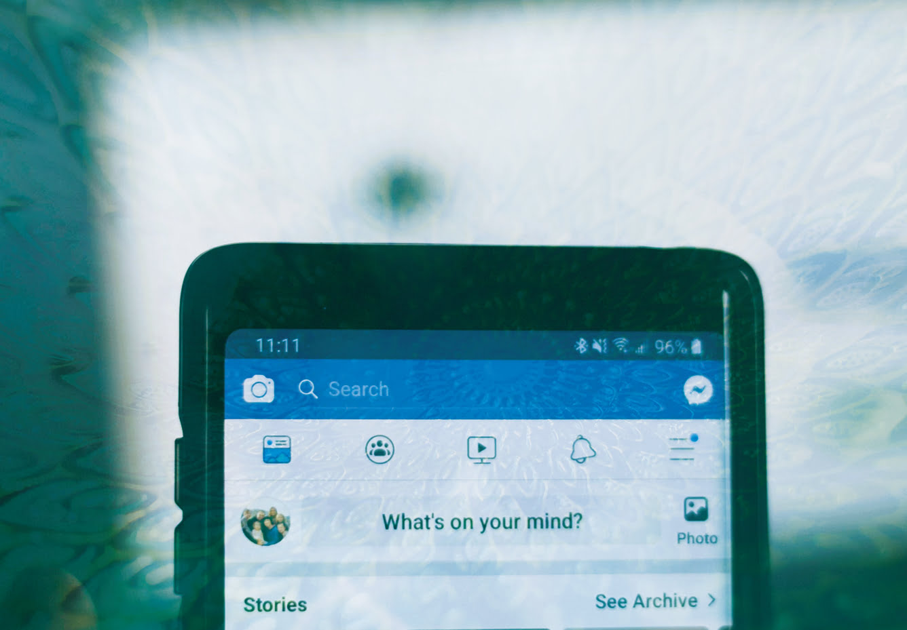
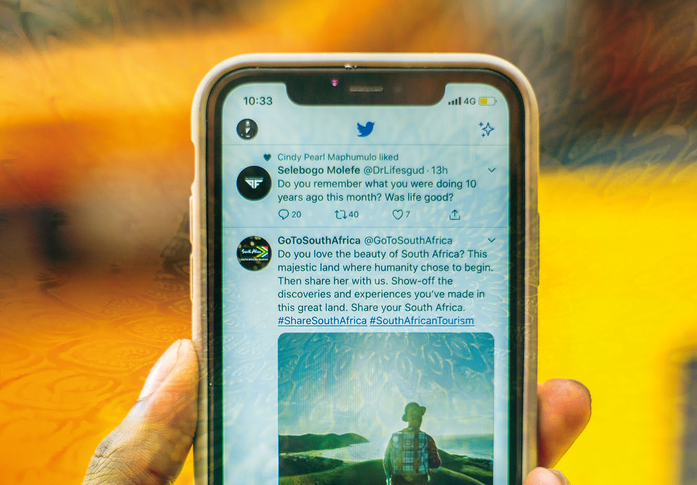

## Once you’re on a roll with the blog writing, you need to make the most of it on your social media accounts.

## If you’re writing a blog every week or two, we need to find four or five bits of content to go with each blog for socials. So, have a look online for things related to your blog – they could be images of film clips or different uses for this week’s deal.

We’ve created a template for blogging and social media for you so that you can feed in blog ideas as you have them and keep track of which posts you’re going to put live and when. This gives you the breathing room to make any changes or rearrangements without throwing your posting schedule completely off track. This allows you to take more time creating a solid story or narrative across your socials, which can leave longer-lasting impressions on users. It also means that you can plan your social media content in advance and then schedule it using Hootsuite so that you can spend, say, half a day each week on it rather than constantly having to go in and out of [Facebook](https://www.facebook.com/eblueprintltd), [Twitter](https://twitter.com/eblueprint), etc.

We’re focusing on your current two accounts:

1. Facebook
2. Twitter
3. Plus Hootsuite - your social media management tool

[Download the full content development plan template](https://ebp-copy.eblue-hosting.co.uk/wp-content/uploads/2021/12/Blogging-Social-Media-Document-e-bp.pdf)

## Facebook

Facebook works best when you’ve got a variety of different content. You don’t have to post on Facebook constantly – every two or three days is fine – but try and mix up your content.
You can use different angles of the blog content on Facebook, for instance:

1. The deal or piece of news itself
2. A short list of benefits of a piece of equipment
3. A quote from Dave
4. A video of the equipment in action
5. Use the hashtags in the spreadsheet and join in on #mondaymotivation or #throwbackthursday – #ThrowbackThursday might seem irrelevant, but it’s a good opportunity for you to show how much experience you have in the area. #MondayMotivation is a good way to show your product expertise.
6. Have a look at the ‘social ideas’ page and see what different angles you can pull out of a blog.

## Joining groups

Groups like this one: https://www.facebook.com/groups/1690015857951923/ offer you the ability to resell, keep an eye on the competition and send your promotions too.
You can also follow a variety of construction sectors, for example: sites, including magazines, contractors etc. and reshare some of their content.

Setting up your own group can even provide better engagement than your Facebook page. This could be a group for a particular event/ product/ promotion rather than something too broad.

## Twitter

Spend some time following people on Twitter who are interesting for the business – they could be your suppliers, other dealers, construction/ farming/ agriculture/ etc. magazines, or even the local councils in the areas that you cove. This will give you more of an idea of what’s going on.

Make sure that you’re following as many of your customers that you can find or other people that you’ would like to work with. You can tag suppliers in tweets about their equipment in order to ‘piggyback’/capitalise on their huge global following. Obviously, they’re not going to retweet everything that you post, but, if you consistently share their products and messages, you’ll start to develop a relationship with them.

## The important things to remember on twitter are:

The 80/20 rule: Tweet about other people and other things 80% of the time and only tweet about yourself 20% of the time – otherwise you’ll sound like a real bore who’s heavy on the sales platter. Try searching hashtags like #gehl and #wackerneuson and retweeting their info…

- People see tweets in real time as they’re tweeted, so don’t be afraid to tweet the same information/ link/ blog several times (although in slightly different ways is preferable)
- Use hashtags! If you’re not sure what hashtags are trending for high profile topics, you can search for them and see what other people are using, such as #wackerneuson #manitou
- Make sure you add a link to the direct blog rather than just your website in general. Copy and paste the URL straight into your tweet!
- Build your Twitter following by increasing the number of people you follow. It’s great for research and keeping abreast of topics, so make sure that you’re following your clients, potential clients, influencers and competitors.
- Include a link to your latest blog on your email signature. Then it’ll catch the eye of anyone you’re communicating with…

## Hootsuite

We recommend https://hootsuite.com/ to manage the distribution of your social media content, and have created you an account. You can use Hootsuite for up to three different platforms for free, so we’ve connected it to your Facebook, Twitter and other social media accounts.

When posting content via Hootsuite, you can choose which channels it goes to, or send it to all three of them. It also shortens links for you to give you more space and allows you to schedule content, so that you can post a series of updates and Hootsuite will dispatch them across the day or week.

You can also get basic analytics via the Hootsuite account that will show you which of your updates perform best.

If you want to use more than three accounts via Hootsuite, you’ll have to upgrade to one of their premium accounts, which start at £7.99 per month.

## Social media dos and don’ts

- Common sense is the key factor. Consider carefully anything you post – if you’re thinking of publishing something that makes you feel even the slightest bit uncomfortable, please don’t post it.
- Don’t get into an argument online. If someone is complaining, ask them to send you a direct message and take it away from you Facebook or Twitter page.
- Respect your audience. Avoid speaking negatively about other people, companies or organisations. Don’t use ethnic slurs, personal insults, obscenity, or engage in any conduct that wouldn’t be acceptable in the workplace. You should also show proper consideration for others’ privacy and for topics that may be considered objectionable or inflammatory (such as religion or politics).
- Don’t talk about clients or partners without their approval.
- Be inclusive. Talk about ‘We…’ and ‘our’; make people think they’re a part of your group
- Make sure you respect copyright laws – don’t just use things and pretend they’re your own. Make sure you reference the source material. For instance, by retweeting it, or naming the place you found it in your post. Don’t take images from Google directly. Instead, consider using a stock image library like Unsplash,com, as you can use for free. Otherwise, check the copyright statement using Google’s search filter.
- Even if you act with the best intentions, you must remember that anything you say about your company can potentially harm it. Please act responsibly.
