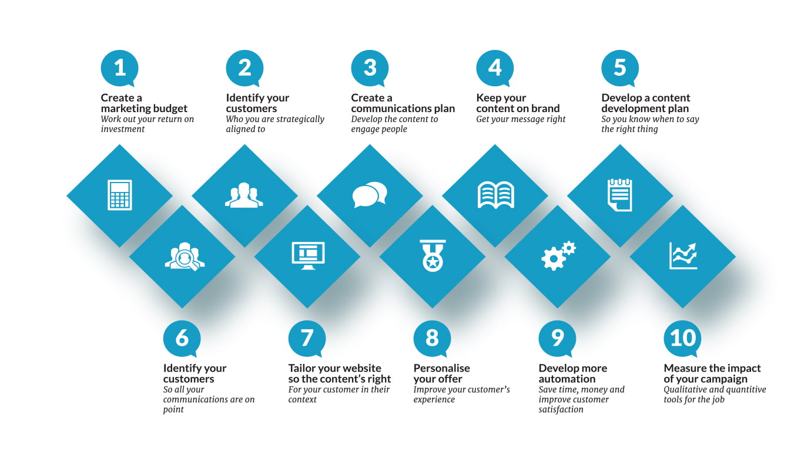
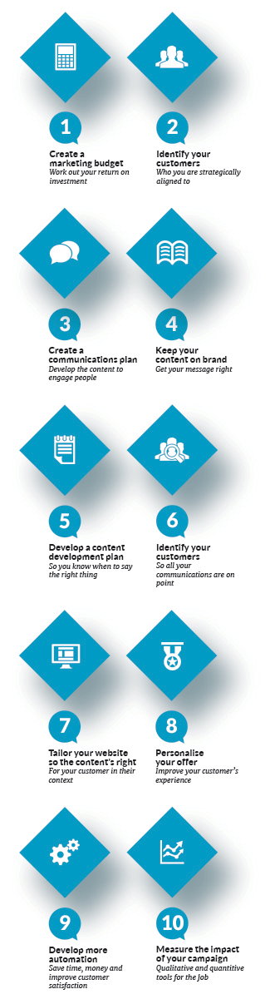

More people than ever before are using the internet on all kinds of devices, connecting people all over the world at incredible speeds to reach brand new customers. Utilising these endless resources of online audiences has returned fantastic results for millions of companies, making digital marketing undeniably valuable to the business world. However, deciding which [tools and techniques](https://ebp-copy.eblue-hosting.co.uk/services/) to use and how much emphasis each marketing channel needs can feel daunting.

You may find yourself asking the following:

_Where do you begin? Do you need a complete SEO (Search Engine Optimisation), PPC (Pay Per Click), social media, or an e-mail marketing campaign? If so, how can you tell when it is successful? Does your website effectively represent you, your colleagues, and the work you do? Is it authentic? Does it function well?_

But wait - there's no reason that these questions need to feel overwhelming. Ultimately, digital marketing boils down to choosing the right tools for the job and prioritising the right channel at the right time. This is where we come in. Our team of experts are on hand to help you pinpoint the best starting position to optimise your business plan. This guidebook will help build your digital confidence alongside revealing the many paths and opportunities within your reach. We will help you understand what advertising and marketing channels are available and teach you the best techniques for the job.

