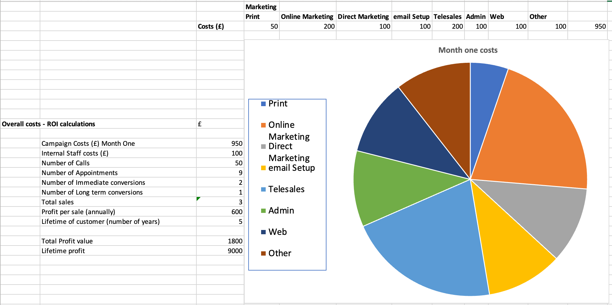

## **Start your digital marketing strategy with our first step: setting a budget for 2022.**

Knowing how to set a marketing budget and what you can get out of it can be hard. Especially when it comes to figuring out **exactly** where to direct your efforts. We've all been there: having a brilliant idea and losing the motivation after hitting the first hurdle. But at e-blueprint, we don't leave any great ideas behind. Our team of brilliant thinkers are always on hand to come up with efficient ways to keep your motivation going. Our fantastic marketing solutions are ready to propel you across the starting line and put your business into full action. With excellent strategies, we are here to help put everything in place to go full steam ahead. We are always only a [call/email/message](/contact/) or [social media message](https://www.linkedin.com/company/e-blueprint/) away to help.

For now, here are some tips on how to get your foot off that starting line and set a marketing budget.

Start small before going for the big bucks. To work out how to set a marketing budget and your ROI, we recommend using any monthly or annual expenses and estimations to calculate expected revenue, profit, and agree on a limit for your expenses (a budget). Your budget will, to some extent, dictate which marketing tools are best for the job, such as having enough to fund a long-running Google Ads campaign or opting for a shorter monthly campaign to try it out. Assess the ROI in year one before calculating your future year's potential profit per customer and how you can scale your business based on these numbers.

If you’re a new business, then any great marketing mind will tell you not to get too caught up on profit in year one. It’s for the same reason that a sprinter doesn’t exert all of their energy at the beginning of the race. They use the first stretch to overcome any hurdles so that the rest of the race is as smooth as possible and on the road to success.

Top tip: keep an eye out for potential operational costs increasing as your sales increase, as this can quickly drain the profit out your campaign.

## A simple formula to calculate ROI

We love chatting to you, but sometimes it’s good to get hands on and see how the cogs turn for yourself. That’s why we’ve created a budget calculator template for you to download and test out. Let us know what you think and if there’s any opportunities that we can lend a hand with.

<a href="/downloads/QuickROICalculator.xlsx" download target="_blank">Download our marketing budget ROI calculator</a>

Next, explore how to [identify your target customer](/news/identify-your-target-customer/) and consider their natural strategic alignment to your services.
