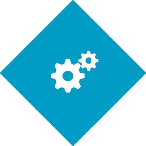

## **Optimising your digital speed doesn't just mean having a [fast website](https://ebp-copy.eblue-hosting.co.uk/blog/mobile-friendly-website-design-a-responsive-website-for-all-devices/). The more time you save using CRM tools, the more time you have to spend helping your business grow.**

CRM stands for Customer Relationship Management. It tracks communications and interactions with customers using tools, techniques and software. Throughout your marketing journey, data will present itself in all different shapes and sizes. It's important to keep track of this data and calculate where your strengths and areas for improvement are. From this, businesses can enhance relationships with the data collected by CRMs, such as data segmentation, analysis and comparisons. The faster that you can collect this data the faster you can make essential improvements to your customer journeys. Once you have a great CRM automation system in place, you'll have more time and confidence to apply those all-important changes to help your business thrive.

So, what is automation? Well, have you ever had to write a weekly email and found yourself getting overwhelmed after manually sorting and typing the 100th email address? Have you ever stressfully counted down the seconds so that you hit send exactly on the hour? Automation is a term for systems that automatically organise and schedule your content, requiring minimal human input. It also reduces the time and difficulty of manually completing admin. It appears across the board, from financial systems, such as XERO, to administration tools, such as Clockify and Trello. From automatic list generators to scheduled campaign launches, integrating systems into your website, such as e-commerce, application forms, and your CRM, has never been easier. You can check out 3000+ ways to improve your systems and how to automate processes within your business here: [https://zapier.com/apps](https://zapier.com/apps).
